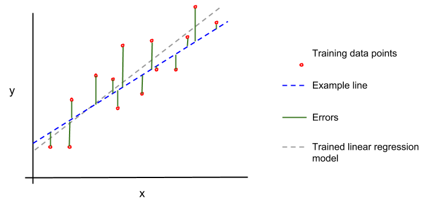

# Regression in Go

breifly, regression is the process of analysing and statistically modelling a relationship between variables, allowing us to predict new values.

it's important to note that regression techniques are concerned with predicting continous values (stock prices, temperature), as opposed to a discreet set of categories (cat/dog/fish, red/blue/green).

_linear regression_, then, is a simple yet fundamental regression model, utilised in other models:

we model the dependant variable y by an independant variable x using the following equation:

## y = mx + b

where m is the slope of the line and b is the intercept

for example, if we wanted to model ice cream sales with temperature, it would be as follows:

ice cream sales = m * (temperature) + b

so how do we find m and b? there are a few, but we'll use the more common 'ordinary least squares' (OLS) method:

1. the first step is to choose or randomise values for both m and b, to create an example line
2. then, we measure the vertical distance between each known point and the example line. these distances are called 'errors'

3. next, we sum the squares of these errors:

\frac{error_1^2+error_2^2+\dotsb+error_n^2}{n} 

now, we adjust (train) the values of m and b until we minimize this sum!

this process, of iteratively optimizing some value or parameter is called _gradient descent_, and is a ubiquitous technique within machine learning, including _deep learning_. 

let's think about gradient descent geometrically - imagine standing on some turbulent 3d landscape (maybe at the top of a hill), with the goal of reaching the lowest elevation possible. to do so algorithmically, you need to take a step in some downward direction - hence the name. there are problems 

### Linear Regression assumptions
like all machine learning models, linear regression doesn't work in all situations, and will either perform poorly or excel, depending on how many of its assumptions are satisfied:

- linear relationship

