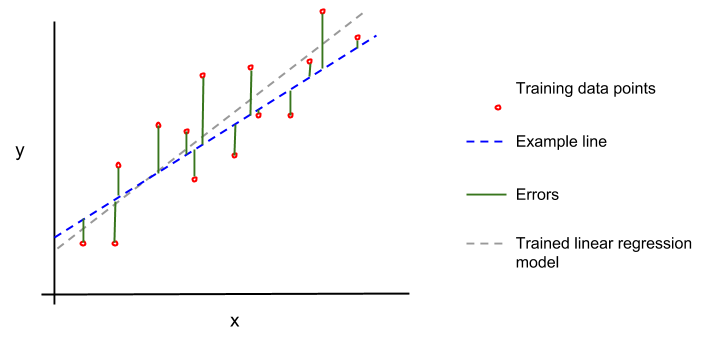

# why?
- i wanted to kill two birds with one stone and do **machine learning** in **golang**, so i chose a simple statistical concept everyone knows and loves
- turns out the problem wasn't with understanding ml/stats concepts, but with actually writing code in go
- now i understand why we use python for data science :) [(hint)](https://pandas.pydata.org/)

## Regression in Go (unfinished notes/tut)

### define regression:

Regression is the process of statistically modelling the relationship between a dependent variable and _n_ independent variables, which enables us to predict new values. Regression techniques are generally concerned with predicting continous values, as opposed to a discreet set of categories.

### 1. Linear Regression

Possibly the most fundamental statistical model, linear regression uses the classic:

`y = mx + b`

Which describes a line with gradient `m` and y-intercept `b`.

One way of calculating `m` and `b` is with [ordinary least squares](https://en.wikipedia.org/wiki/Ordinary_least_squares) method:

1. Randomise values for both m and b to create an example line
2. Find the distance between the example line and each value in the dataset. These distances are called 'errors':

3. Sum the squares of these errors:

Now, we iteratively adjust the values of `m` and `b` in order to minimize this sum. A ubiquitous optimization technique to find local minima is called _gradient descent_, but that's a topic for another day :)

The accuracy and performance of linear regression is dependant on its **assumptions**:

- **Linearity**: there is a linear relationship between the dependant variable and the independant variable(s)
- **Normality**: your variables are distributed normally
- **No multicollinearity**: your independant variables should not be predictors of eachother
- **No auto-correlation**: a fancy way of saying your variables should not depend on themselves, i.e they are not values in a time series; Tesla's share price, for example

**Pitfalls**:
- Extrapolation beyond the model can quickly become very inaccurate
- Extreme outliers can throw off the model

*'twas here i realised that i was only writing notes to escape having to debug*
